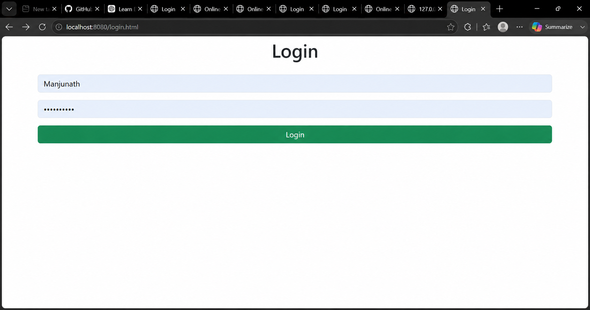
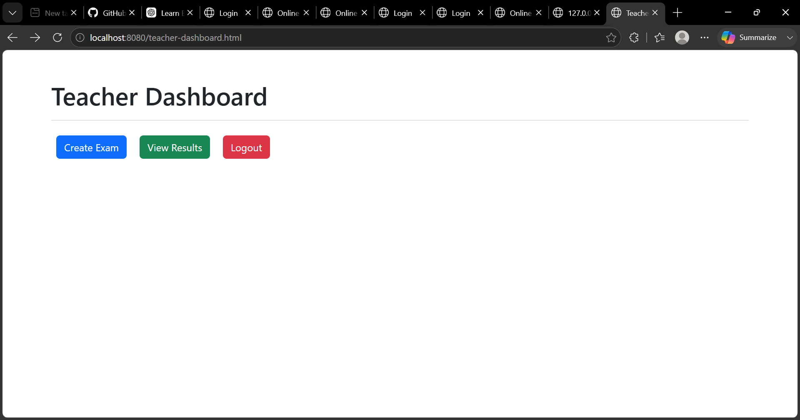
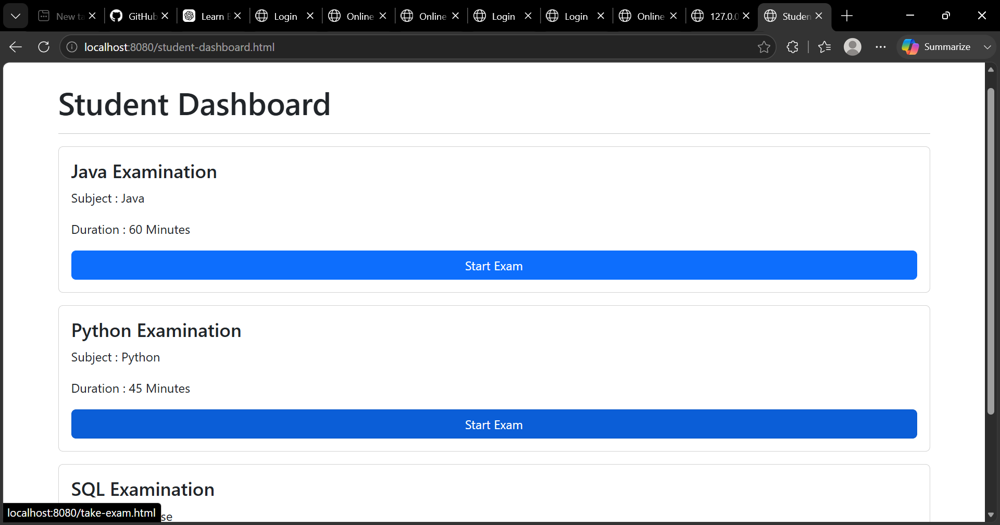
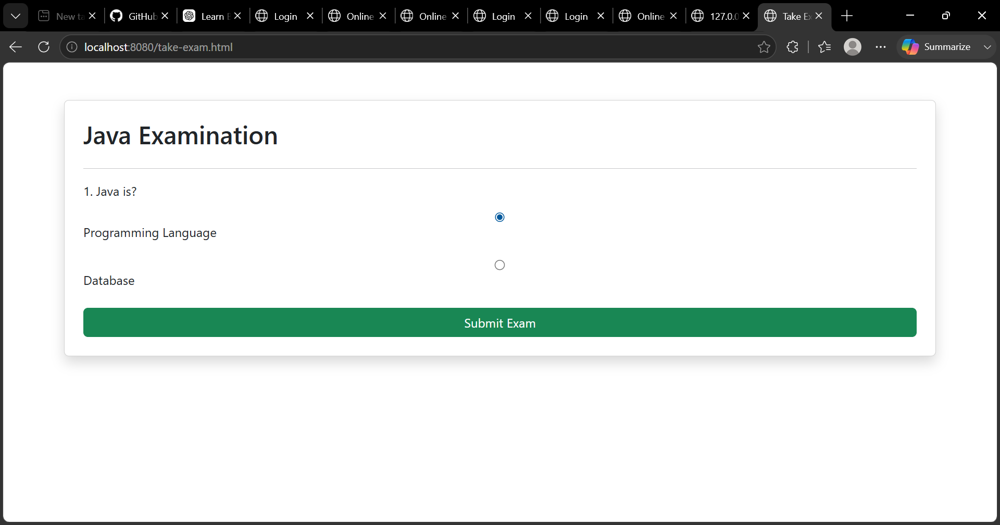
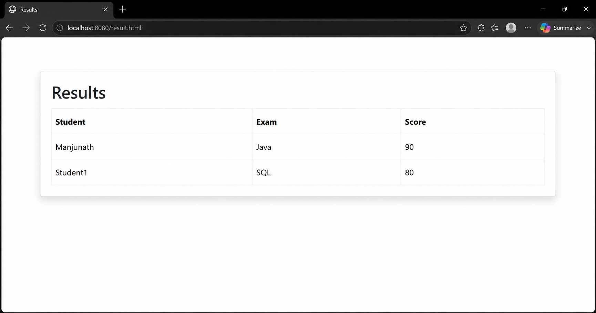

# Online Examination System

## Project Description

I developed an Online Examination System as a Full Stack Java project using Spring Boot, Spring Security, Hibernate, MySQL, HTML, CSS, Bootstrap, and JavaScript.

The main objective of this project is to provide a platform where teachers can create examinations and students can attend exams online and view their results securely.

Through this project, I implemented role-based authentication, REST APIs, database integration, and a responsive user interface.

---

## Features Implemented

### Teacher Module

* Teacher Login
* Create Examinations
* Manage Examination Data
* View Student Results

### Student Module

* Student Login
* View Available Examinations
* Attend Online Exams
* Submit Answers
* View Results

### Security

* Spring Security Authentication
* Role-Based Access Control
* Password Encryption using BCrypt

---

## Technologies Used

### Backend

* Java
* Spring Boot
* Spring Security
* Hibernate / JPA
* Maven

### Frontend

* HTML5
* CSS3
* Bootstrap 5
* JavaScript

### Database

* MySQL

### Tools

* VS Code
* Thunder Client
* Git
* GitHub

---

## What I Learned

While developing this project, I gained practical experience in:

* Building REST APIs using Spring Boot
* Implementing Authentication and Authorization using Spring Security
* Connecting Spring Boot applications with MySQL
* Performing CRUD Operations using Hibernate and JPA
* Designing responsive web pages using Bootstrap
* Testing APIs using Thunder Client
* Managing source code using Git and GitHub

---

## Screenshots

### Student Login

### Teacher Dashboard

### Exam Creation

### Available Exams

### Take Examination

### Examination Results

### Student Result View

---

## Future Improvements

I plan to enhance this project by adding:

* Student Registration
* Forgot Password Functionality
* Email Notifications
* OTP Verification
* Exam Timer
* Analytics Dashboard
* JWT Authentication

---

## Author

* MANJUNATH **

Java Full Stack Developer

GitHub: https://github.com/Angadimanjunath
